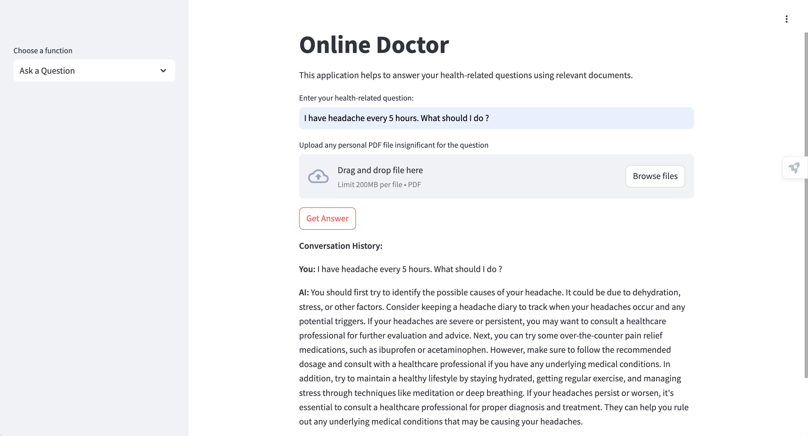
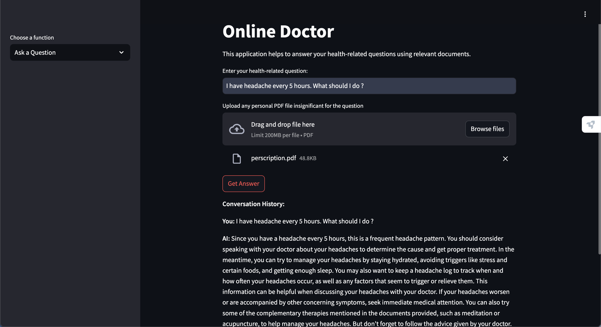

# Online Doctor - Healthcare AI Assistant

## Table of Contents

- [Overview](#overview)
- [Features](#features)
- [Architecture & Workflow](#architecture--workflow)
- [Installation](#installation)
- [Usage](#usage)
- [Interface](#interface)

## Overview

**Online Doctor AI Assistant** is a healthcare-focused conversational application that leverages advanced natural language processing models to provide accurate and relevant medical advice. By integrating **Llama 3.1**, **BioBERT**, and a **Chroma** vector database with a vector database and other specialized models, the app ensures that users receive informed and contextually appropriate responses to their health-related queries.


## Features

- **Advanced Language Models**: Utilizes LLaMA 3.1 for generating comprehensive answers and BioBERT for biology-specific embeddings.
- **Vector Database Integration**: Integrated with ChromaDB containing comprehensive health related information with initial construction of information from the *Oxford Handbook of Clinical Medicine*.
- **Dynamic Information Retrieval**: Employs Biobert (align with healthcare) for generating embeddings and DistilBERT for grading the relevance of retrieved information.
- **Real-time Web Search**: Integrates with TailyAI to fetch and incorporate up-to-date information when necessary.
- **Conversation Persistence**: Maintains conversation history using LangGraph and MemorySaver for context-aware interactions.
- **PDF Processing**: Allows users to upload and integrate long documents (e.g., medical books) and short documents (e.g., prescriptions) as context, extracting text using PyTesseract (include OCR features).
- **Scalable Workflow Management**: Defines agent flows using LangGraph for a streamlined and persistent conversational experience.

## Architecture & Workflow

1. **User Interaction**: Users input their health-related questions through the Streamlit interface.
2. **Embedding Generation**: 
   - **BioBERT** generates embeddings for the input question, ensuring alignment with biological and medical terminology.
3. **Information Retrieval**:
   - The embeddings are used to query the **Chroma** vector database, retrieving the top 3 most relevant documents.
4. **Relevance Grading**:
   - **DistilBERT** assesses the relevance of each retrieved document against the user's question.
   - Relevant documents are forwarded to **LLaMA 3.1** for answer generation.
   - Irrelevant documents trigger a web search via **TailyAI**, fetching additional relevant information which is then added to the vector database.
5. **Answer Generation**:
   - **LLaMA 3.1** synthesizes an informed and concise answer using the relevant documents, user-provided context, and conversation history.
6. **Conversation Persistence**:
   - **LangGraph** manages the workflow and conversation flow, while **MemorySaver** ensures that conversation history is stored and maintained across sessions.
7. **PDF Handling**:
   - Users can upload PDFs containing extensive information (e.g., medical textbooks) or concise data (e.g., prescriptions).
   - **PyTesseract** extracts text from uploaded PDFs, which is then processed and integrated into the conversation context.

## Installation

### Prerequisites

- **Python 3.8+**
- **pip** package manager

### Clone the Repository

```bash
git clone https://github.com/Nuna7/HealthCareLlama3.1.git
cd HealthCareLlama3.1
```
### Create a Virtual Environment
- It's recommended to use a virtual environment to manage dependencies.
```bash
python -m venv env
source env/bin/activate
```

### Install Dependencies
```bash
pip install streamlit langchain transformers tavily-python pdfplumber chromadb pysqlite3-binary langchain_community langgraph bitsandbytes pytesseract pdf2image Pillow langchain-huggingface python-dotenv
apt-get install poppler-utils -y
```

## Configuration
**Setting Up Environment Variables:**
To securely manage API keys and other sensitive information, use an environment file.

1. **Create a .env File:**
      In the root directory of the project, create a file named .env
      ```bash
      touch .env
      ```
2. **Add Your API Keys to .env:**
     ```env
     HF_TOKEN=YOUR_HF_TOKEN
     TAVILY_API_KEY=YOUR_TAVIY_TOKEN
     ```

## Usage
**Run the Application:**
   ```bash
   streamlit run main.py
   ```

## Interface
1. ### You can interact with AI agent and upload short information like prescription.



2. ### You can also upload long information like healthcare books to enhance AI knowledge.
   



